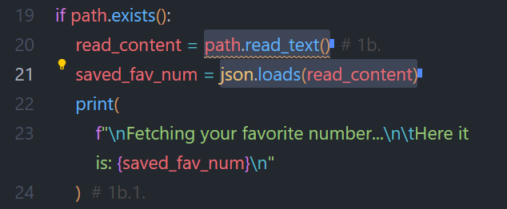
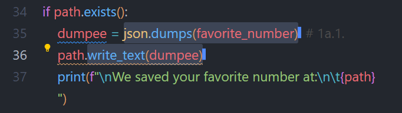
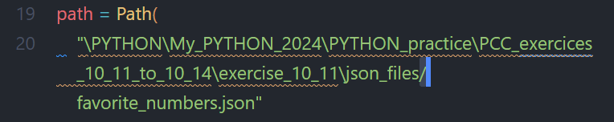
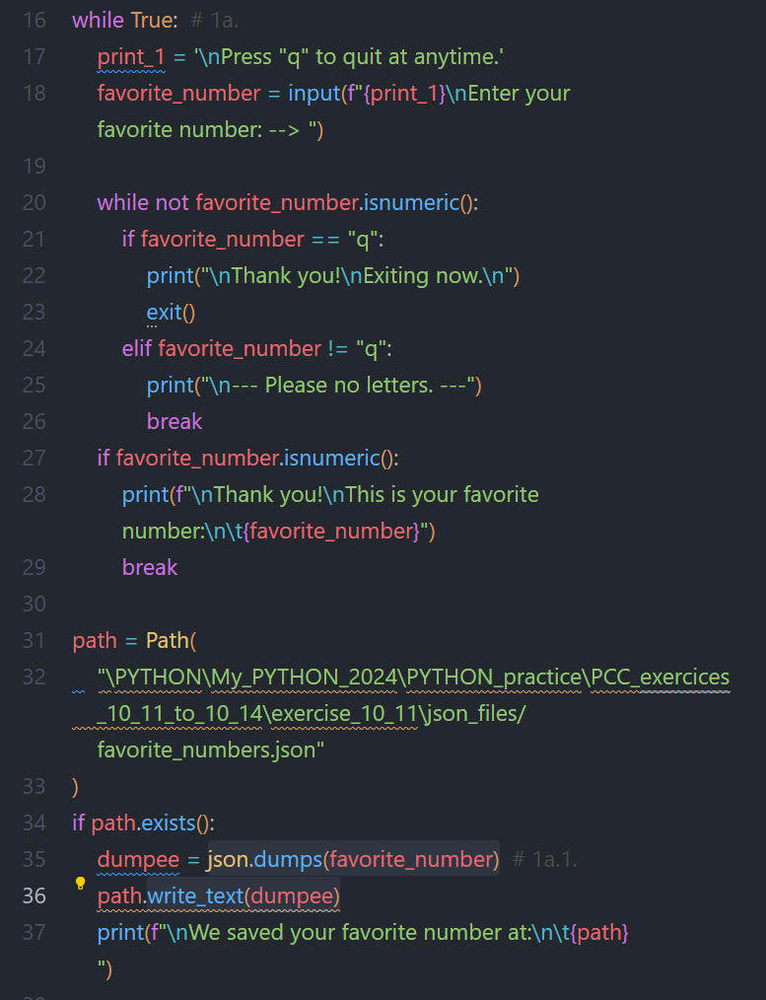

# WHAT I LEARNT

---

## Store/Use Data & Files

As a beginner developer I am still not grasping all the things that one can do with the pathlib library and the json package. But I do know that the possibilities are numerous. 

The logic to get Python write or read files is not hard to understand, it is **just a little unusual**. The json methods of `.load()` and `.dumps()` are also easy enough to grasp.  
And so we end up with the pairs:  
- **loads + read**:
  
  

- and **dumps + write**:
  
  

### File Path Issues on Windows

To manipulate data the pathlib library **needs a path** to the relevant file. Tow options are available: **relative or absolute paths**. The first one being short and closer, and the other one being fits-all cases but usually much much longer. 

And necessarily the path is made of a series of folder names **separated by "/" or "\\"**. And **here lies the issue on windows**.  
But first, it took me a while to see that **VScode has a feature for that** (right click on a file). No need to navigate to the file folder and copy the path from there. Even better, it gives you the option between relative and absolute (that they just call path).  

But the **pasted path is not compatible**, because of the separators being "\\". It took me a couple of hours to figure this out... The book do mention that Windows does not use "/" and that we should use them anyway. And that is what I did, however **I found out that only the last separator needs to be changed to a "/"**. 

---

## Data Stored for Usability

One of the things that storing data increases is the **usability of a program**.  
In exercise 10-12 I was asked to print out the user favorite number if it was stored previously. If not, an invite to store one is prompted. This is **essentially adding a memory function** to the program, or **in other terms making it easier for users to remember** their favorite number. 

Let's see it reverse, as in if that memory feature didn't exist. Anyone would use it once, and then maybe twice, but then that person would have to, again, just enter the number. **This is reducing the program to a basic and bare prompting function**, with a very low value given to its use.  
And this makes it **a no-come-back** for users. 

This is touching down on a **defining characteristic of machines**, or computers: their **incomparable ability to memorize data**. We Humans can memorize things, but nowhere near the capacity of machines, and also the speed at which they memorize!  
And they also have a better recall ability, as well as a better maintained accuracy of the data. **Untrained humans usually forget after 2 seconds** (this is a fact, I am not inventing it). 

--- 

## Refactoring to Keep Breathing

For the exercise 10-14 I was asked to refactor the code of the exercise 10-13. Before I did that **I felt uncomfortable reading my code**, because of its length (over 80 lines), the lack of structure and its complexity due to a few nested ifs and elifs.  
That feeling induced stress, I am not sure at what level, but stress I felt. Or rather, **it was the fact that I had to make effort to read it and that effort generated some stress**. It felt unnatural to me. 

I used 'breathing' in the title of this paragraph because **breathing is what we usually do to calm ourselves, to decrease stress**. And by **refactoring, the end result is that, less stress**, and so I tend to keep my breathing unchanged. 

Of course Refactoring is not just better for me, **it needs to be done so that other developers can also keep their calm** when they first read my code. A very deontological approach actually (I'm having a philosophical dive lately). 

--- 

## How Well Did I do?

After I compared my code to the solutions: 
- **exercise 10-11**:  
  I outdid myself a little here. I made it a looped program (line 16) with a quit option (line 21) and also filters applied to the input to rule out anything but a numerical input or the "q" to quit, all of that in a nested while loop to ensure the input is entered (line 20 to 26).  
  Then I check if the file where to dump the input data exists and if so I dump it in there (lines 34 to 37). I did this in both the write_fav_num.py and the read_fav_num.py.

  

  GRADE: High pass IMHO. 

- **exercise 10-12**:  
  Because of my work on 10-11, my code is longer. But it is also more user friendly and funneled down.  
  My mistake is that **I did not use a try/except block to catch a FileNotFoundError exception** when trying to read the file (line 22):

   

- **exercise 10-13 & 10-14**:
  It felt good to refactor the code into functions. I did not make a ton of mistakes while doing it, so that felt great to see that the practice is starting to pay off. And once finished, I looked at the code and I felt some pride. A feeling I recommend to anyone. 

  The solution code is comparatively shorter than mine but I chose to extend on it beforehand.  
  That said, the **solution code is cleaner**, because **I did not make each function independent**, instead 3 of them are nested in the first one. But then none of my functions have a parameter to call. At this point, I am not sure this a good thing or not. 

  GRADE: a small pass, without style and with a necessary review

---

#### Resources:
Python Crash Course 3rd Ed.: [solutions to exercises 10-11 to 10-14](https://ehmatthes.github.io/pcc_3e/solutions/chapter_10/#10-11-favorite-number)
